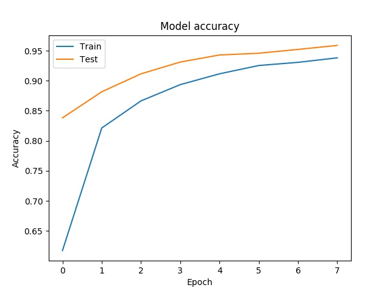
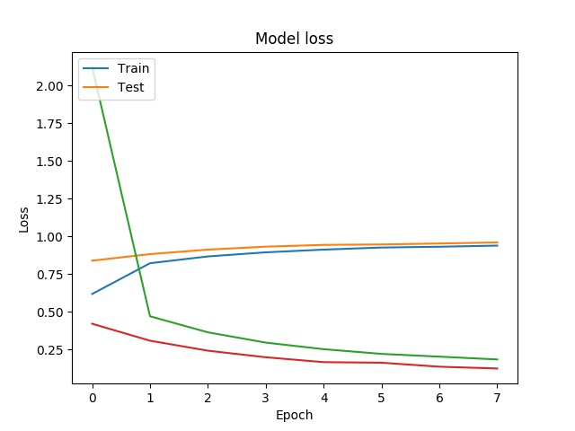
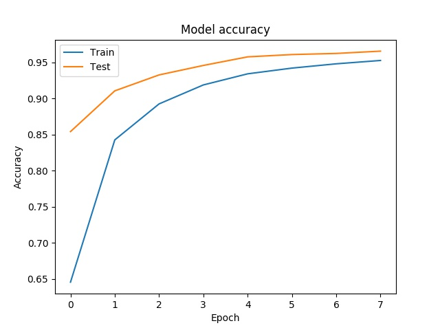
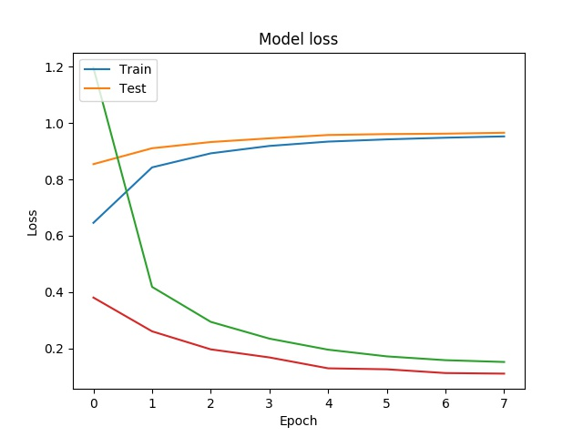

# correct_orientation
[](https://img.shields.io/badge/python-3.7.3-green.svg)

From incorrectly rotated images models of neural networks were trained, enabling the correction of these images. As an example below:


## Setup Project

Frist you need install [Poetry](https://poetry.eustace.io/docs/), after install Poetry execute inside the directory `correct_orientation`:
  
  `$ poetry install`

Now you have all the necessary dependencies on this project.

- If your poetry environment is not activate or you are not sure, execute:

  `$ poetry shell`

## How to run this project

In this project was implemented two neural network models.
If you want to run the first model, execute:

`$ python main.py -nomy`

If you want to run the second model, execute:

`$ python main.py -my`

> OBSERVATION

> The model weights are already in the project, so execution will only generate the correctly rotated images. If you want to retrain the model, delete the files in the folder `correct_orientation/utils/files/`

1) The first model was the CIFAR10 from [Keras](https://keras.io/examples/cifar10_cnn/):

```
model = Sequential()
model.add(Conv2D(32, (3, 3), padding='same',
                 input_shape=x_train.shape[1:]))
model.add(Activation('relu'))
model.add(Conv2D(32, (3, 3)))
model.add(Activation('relu'))
model.add(MaxPooling2D(pool_size=(2, 2)))
model.add(Dropout(0.25))

model.add(Conv2D(64, (3, 3), padding='same'))
model.add(Activation('relu'))
model.add(Conv2D(64, (3, 3)))
model.add(Activation('relu'))
model.add(MaxPooling2D(pool_size=(2, 2)))
model.add(Dropout(0.25))

model.add(Flatten())
model.add(Dense(512))
model.add(Activation('relu'))
model.add(Dropout(0.5))
model.add(Dense(num_classes))
model.add(Activation('softmax'))
```
You can see the model behavior during training in the figure:




2) The second model was a adaptation from CIFAR10 (first model), in particularly I prefer this model because run faster than the first model (in my computer).

```
model = Sequential()
model.add(Conv2D(32, (3, 3), padding='same',
                 input_shape=x_train.shape[1:]))
model.add(Activation('relu'))
model.add(Conv2D(32, (3, 3)))
model.add(Activation('relu'))
model.add(MaxPooling2D(pool_size=(2, 2)))
model.add(Dropout(0.25))

model.add(Conv2D(64, (3, 3), padding='same'))
model.add(Activation('relu'))
model.add(Conv2D(64, (3, 3)))
model.add(Activation('relu'))
model.add(MaxPooling2D(pool_size=(2, 2)))
model.add(Dropout(0.25))

model.add(Flatten())
model.add(Dense(512))
model.add(Activation('relu'))
model.add(Dense(512))  # new
model.add(Activation('relu'))  # new
model.add(Dropout(0.5))
model.add(Dense(num_classes))
model.add(Activation('softmax'))
```
You can see the model behavior during training in the figure:




